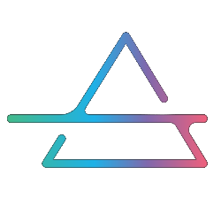

<!-- Compact logo -->

  

# 👋 Hi, I'm Mhmoud E. Atiyah

**Software Engineer • Site Reliability Engineer • DevOps Engineer**  
**Head Developer of IQraa Platform**  
Open Source Enthusiast • Linux Advocate

💡 I design **scalable backend systems**, ensure **reliability in production**, and build **platforms that empower communities**. My core interests: **Linux, cloud-native architectures, API design, and knowledge platforms**.

  

---

## 🛠️ Tech Stack & Tools

---

## 🌟 IQraa Platform — Hub for Books & Knowledge

📌 **Role**: Head Developer  
📌 **Mission**: Empower readers and authors by creating a **digital hub for books, knowledge, and community interaction**.

**IQraa** is an innovative platform where users can:
- 📖 **Read** digital books and curated knowledge collections
- ✍️ **Create & Publish** works as an author, researcher, or content creator
- 🤝 **Share & Connect** with communities built around topics, genres, and libraries
- 📚 **Build Your Library** and organize your personal reading and study journey
- 🌍 **Engage with Authors & Communities** through discussions, events, and collaborative spaces

### Vision
IQraa goes beyond being a reading app — it is a **knowledge ecosystem** designed to:
- Preserve culture and literature in the digital age
- Connect readers, authors, and libraries across borders
- Encourage collaboration, learning, and the free flow of ideas

### Tech Foundations
- **Frontend**: Kotlin (Jetpack Compose) for Android, Apple ios (soon), React (next.js) Web-based UI
- **Backend**: Node.js, PostgreSQL, Redis
- **Media & Knowledge Sharing**: Secure APIs, structured data models for books and authors
- **Infra**: Docker, Kubernetes, Jenkins — ensuring high availability and scalability

### Key Capabilities
- 🔐 Secure publishing, chating & user identity (JWT, TLS, E2E)
- ⚡ Scalable library & catalog systems (efficient indexing & caching)
- 📦 Reliable media delivery (chunked uploads, S3-compatible storage)
- 📈 Observability & SRE practices (Prometheus, Grafana, structured logs)
- 🌐 Community features (groups, events, author pages, discussions)

### Roadmap
- ✅ Core book reading & library features
- ✅ Author publishing module
- ✅ Multi-language support (Arabic, English, French, ...)
- ✅ End-to-End Chating system
- ✅ Books & Publications Reader 
- 🔜 Community groups & events
- 🔜 Advanced search & recommendations

🌐 **Explore IQraa:** [Visit Landing Page](https://mhmoud-atiyah.github.io/iqraa_landing/)

---

## 📊 GitHub Stats

---

## 📫 Connect with Me

- ✉️ [Email](mailto:mhmoudebrahiematiyah@gmail.com)
- 💻 [GitHub](https://github.com/Mhmoud-Atiyah)
- 🔗 [LinkedIn](https://www.linkedin.com/in/mhmoudatiyah/)
- 🐦 [Twitter](https://twitter.com/Ebnattia)
- 💬 [WhatsApp](https://wa.me/+201147643343)

---

✨ Always open to collaborations in **Linux, DevOps, SRE, open-source, or knowledge-sharing platforms**.

*IQraa — where books meet community, and knowledge connects people.*
